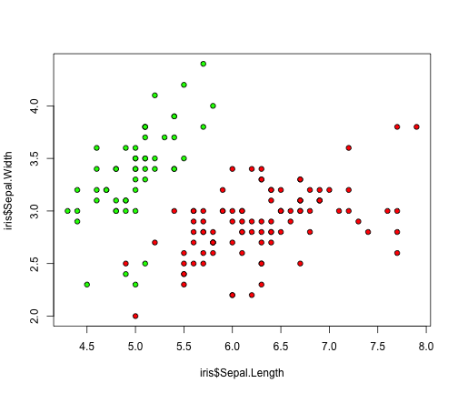
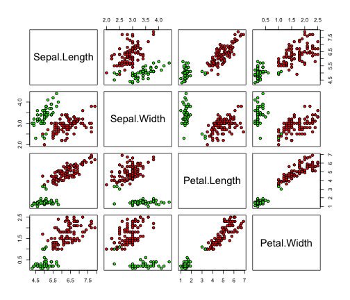
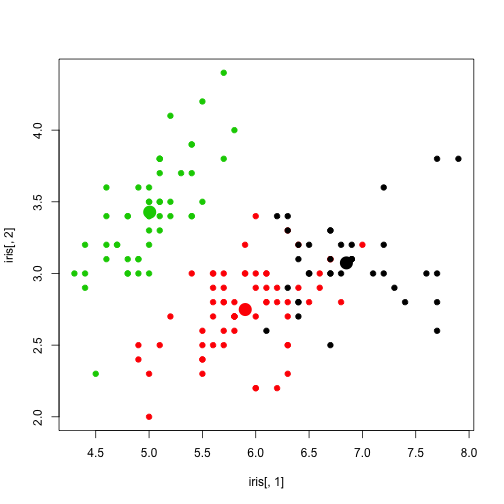
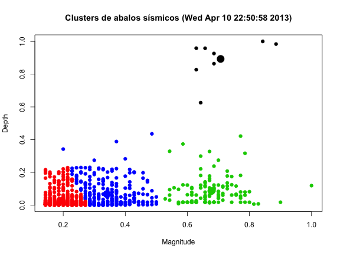

Laboratório sobre algoritmos de clustering
========================================================
**Professor Fabrício J. Barth**

Introdução
----------
O objetivo deste laboratório é exercitar os conceitos vistos em sala de aula utilizando a **ferramenta R**.
O primeiro exercício irá utilizar o datataset sobre a planta [Iris](http://archive.ics.uci.edu/ml/datasets/Iris). O R já vem com este dataset, portanto basta digitar o comando abaixo.


```r
data(iris)
```


O dataset é formado por 4 atributos e uma classe:


```r
head(iris)
```

```
##   Sepal.Length Sepal.Width Petal.Length Petal.Width Species
## 1          5.1         3.5          1.4         0.2  setosa
## 2          4.9         3.0          1.4         0.2  setosa
## 3          4.7         3.2          1.3         0.2  setosa
## 4          4.6         3.1          1.5         0.2  setosa
## 5          5.0         3.6          1.4         0.2  setosa
## 6          5.4         3.9          1.7         0.4  setosa
```


O algoritmo K-means é implementado na função **kmeans**. Se quisermos identificar dois clusters no dataset
iris, basta digitar:


```r
modelCluster <- kmeans(iris[, 1:4], centers = 2)
modelCluster
```

```
## K-means clustering with 2 clusters of sizes 97, 53
## 
## Cluster means:
##   Sepal.Length Sepal.Width Petal.Length Petal.Width
## 1        6.301       2.887        4.959      1.6959
## 2        5.006       3.370        1.560      0.2906
## 
## Clustering vector:
##   [1] 2 2 2 2 2 2 2 2 2 2 2 2 2 2 2 2 2 2 2 2 2 2 2 2 2 2 2 2 2 2 2 2 2 2 2
##  [36] 2 2 2 2 2 2 2 2 2 2 2 2 2 2 2 1 1 1 1 1 1 1 2 1 1 1 1 1 1 1 1 1 1 1 1
##  [71] 1 1 1 1 1 1 1 1 1 1 1 1 1 1 1 1 1 1 1 1 1 1 1 2 1 1 1 1 2 1 1 1 1 1 1
## [106] 1 1 1 1 1 1 1 1 1 1 1 1 1 1 1 1 1 1 1 1 1 1 1 1 1 1 1 1 1 1 1 1 1 1 1
## [141] 1 1 1 1 1 1 1 1 1 1
## 
## Within cluster sum of squares by cluster:
## [1] 123.80  28.55
##  (between_SS / total_SS =  77.6 %)
## 
## Available components:
## 
## [1] "cluster"      "centers"      "totss"        "withinss"    
## [5] "tot.withinss" "betweenss"    "size"         "iter"        
## [9] "ifault"
```


A execução do algoritmo kmeans levou em consideração apenas os atributos números (excluímos a classe).
O resultado pode também ser visualizado na forma de plot:


```r
plot(iris$Sepal.Length, iris$Sepal.Width, pch = 21, bg = c("red", "green")[modelCluster$cluster])
```

 


Podemos também visualizar todos os atributos: 


```r
plot(iris[, 1:4], pch = 21, bg = c("red", "green")[modelCluster$cluster])
```

 


No entanto, será que este é o número de cluster mais adequados? Para implementar a análise **elbow** podemos utilizar a seguinte função:


```r
elbow <- function(dataset) {
    wss <- numeric(15)
    for (i in 1:15) wss[i] <- sum(kmeans(dataset, centers = i, nstart = 100)$withinss)
    plot(1:15, wss, type = "b", main = "Elbow method", xlab = "Number of Clusters", 
        ylab = "Within groups sum of squares", pch = 8)
}
```


E utilizá-la com o dataset iris:


```r
elbow(iris[, 1:4])
```

```
## Warning: did not converge in 10 iterations
```

 


A partir desta análise é possível verificar que o número ideal de cluters é 3. Depois disso, podemos imprimir apresentando os clusters de forma visual em conjunto com os seus centros.


```r
clusterModel <- kmeans(iris[, 1:4], centers = 3, nstart = 100)
plot(iris[, 1], iris[, 2], col = clusterModel$cluster, pch = 19)
points(clusterModel$centers, col = 1:3, pch = 19, cex = 2, lwd = 3)
```

 


Exercício com dados sobre abalos sísmicos
-----------------------------------------

Para iniciar este exercício, nós vamos capturar os dados deste endereço Web:


```r
# fileUrl <-
# 'http://earthquake.usgs.gov/earthquakes/catalogs/eqs7day-M1.txt'
# download.file(fileUrl,destfile='earthquakeData.csv',method='curl')
# dateDownloaded <- date() - Wed Apr 10 22:50:58 2013
eData <- read.csv("earthquakeData.csv")
```


Quais são os atributos? Qual é a dimensão do dataset? Quais são os tipos dos atributos?


```r
names(eData)
```

```
##  [1] "Src"       "Eqid"      "Version"   "Datetime"  "Lat"      
##  [6] "Lon"       "Magnitude" "Depth"     "NST"       "Region"
```

```r
dim(eData)
```

```
## [1] 1092   10
```

```r
sapply(eData, class)
```

```
##       Src      Eqid   Version  Datetime       Lat       Lon Magnitude 
##  "factor"  "factor"  "factor"  "factor" "numeric" "numeric" "numeric" 
##     Depth       NST    Region 
## "numeric" "integer"  "factor"
```


Vamos utilizar os atributos _magnitude_ e _depth_ para identificar abalos sísmicos similares.


```r
summary(eData$Magnitude)
```

```
##    Min. 1st Qu.  Median    Mean 3rd Qu.    Max. 
##    1.00    1.20    1.60    2.01    2.30    7.00
```

```r
summary(eData$Depth)
```

```
##    Min. 1st Qu.  Median    Mean 3rd Qu.    Max. 
##     0.0     3.2     9.9    28.1    29.8   571.0
```


Pode-se perceber que a amplitude destas variáveis é bem diferente. Para que possamos utilizar um algoritmo de clustering sobre estas variáveis é necessário normaliza-las.


```r
eData$MagnitudeNorm <- eData$Magnitude/max(eData$Magnitude)
eData$DepthNorm <- eData$Depth/max(eData$Depth)
```


Levando-se em consideração os dois novos atributos, podemos determinar o número de clusters adequado:


```r
elbow(eData[, 11:12])
```

 


Podemos considerar que o número de clusters mais adequado é 4.


```r
set.seed(1234)
clusterModel <- kmeans(eData[, 11:12], centers = 4, nstart = 100)
# par(mfrow=c(1,2))
plot(eData[, 11], eData[, 12], col = clusterModel$cluster, pch = 19, xlab = "Magnitude", 
    ylab = "Depth", main = "Clusters de abalos sísmicos (Wed Apr 10 22:50:58 2013)")
points(clusterModel$centers, col = 1:4, pch = 19, cex = 2, lwd = 3)
```

 

```r

plot(eData[, 7], eData[, 8], col = clusterModel$cluster, pch = 19, xlab = "Magnitude", 
    ylab = "Depth", main = "Clusters de abalos sísmicos - valores originais")
```

 

```r
# points(clusterModel$centers, col = 1:4, pch=19,cex=2,lwd=3)
clusterModel
```

```
## K-means clustering with 4 clusters of sizes 8, 688, 118, 278
## 
## Cluster means:
##   MagnitudeNorm DepthNorm
## 1        0.7071   0.89294
## 2        0.1947   0.02568
## 3        0.6775   0.08595
## 4        0.3404   0.06738
## 
## Clustering vector:
##    [1] 2 2 2 2 4 4 2 2 3 4 2 2 3 2 2 3 2 2 2 2 4 3 3 4 2 2 2 3 2 2 4 2 2 4
##   [35] 4 3 2 3 4 2 4 2 2 2 4 4 4 2 2 3 2 4 4 4 4 3 2 2 2 2 2 2 2 2 2 4 4 4
##   [69] 3 2 2 4 2 4 2 2 4 2 2 3 2 2 2 4 3 4 3 2 4 4 2 3 2 2 2 2 4 2 4 2 2 4
##  [103] 2 2 2 2 2 4 3 2 4 2 2 3 3 2 3 2 2 2 4 2 3 3 2 4 2 3 2 2 2 2 2 2 4 3
##  [137] 2 4 2 2 3 3 4 2 2 2 2 3 3 2 2 3 4 2 3 2 4 2 2 3 2 4 3 2 3 2 2 4 2 3
##  [171] 2 4 2 2 2 3 2 2 2 3 2 2 2 4 4 4 4 3 4 3 2 2 2 2 4 4 1 3 2 3 2 4 3 2
##  [205] 3 2 3 2 3 1 2 2 4 2 4 2 4 4 2 4 2 2 2 2 4 4 4 4 2 2 2 2 2 3 4 3 2 3
##  [239] 3 2 2 2 2 4 2 2 4 4 2 2 2 2 2 4 2 2 2 2 2 2 2 3 2 2 2 4 4 2 2 2 2 2
##  [273] 2 2 2 4 2 2 2 3 2 2 4 4 4 2 2 2 2 2 2 4 2 2 2 4 2 2 3 4 4 2 2 2 2 2
##  [307] 2 4 2 3 2 4 2 2 2 2 4 2 2 2 3 4 2 3 4 2 2 2 2 2 4 2 2 4 2 2 2 2 2 4
##  [341] 2 4 4 2 2 2 2 4 4 4 2 2 2 2 2 4 2 2 2 4 4 2 3 4 2 4 2 2 4 2 2 4 3 4
##  [375] 2 2 2 2 4 2 4 2 2 4 4 2 2 2 2 4 2 2 4 4 2 4 4 3 2 2 4 2 2 3 2 4 2 2
##  [409] 2 2 2 2 4 2 2 4 3 2 2 2 2 4 2 2 2 4 2 2 2 2 2 2 2 4 4 2 2 4 2 2 2 2
##  [443] 2 2 2 2 2 2 2 2 3 2 2 2 2 4 3 2 4 2 2 1 4 2 2 4 2 2 4 2 2 2 2 2 2 2
##  [477] 3 2 3 4 2 4 2 2 4 2 2 2 2 2 4 2 2 4 4 2 4 2 4 1 2 2 2 4 2 2 4 2 2 2
##  [511] 2 2 2 2 3 3 4 2 2 4 2 3 2 2 2 4 4 2 4 4 2 4 2 2 2 2 2 4 2 2 2 4 4 4
##  [545] 4 2 3 2 3 2 2 2 3 2 2 2 4 2 2 4 2 2 2 2 2 2 3 4 2 2 2 4 4 2 4 4 4 4
##  [579] 2 4 4 4 2 2 4 4 2 2 2 4 4 4 2 2 2 2 2 3 4 2 2 3 2 2 2 2 3 2 2 2 2 4
##  [613] 4 2 2 4 2 2 2 2 2 4 2 2 4 4 2 2 4 4 4 3 2 2 2 2 2 4 4 4 2 2 4 2 2 2
##  [647] 4 4 2 2 2 2 2 2 4 2 2 2 2 2 2 2 2 3 3 2 4 3 2 2 4 3 2 2 3 3 2 2 2 2
##  [681] 2 2 3 2 3 2 4 4 2 2 2 2 3 2 4 3 2 4 3 2 2 2 2 3 2 4 4 2 3 2 2 2 3 4
##  [715] 2 4 2 4 2 2 2 2 2 4 4 3 4 2 2 4 2 2 2 4 4 4 4 4 4 4 2 2 2 2 2 3 2 2
##  [749] 4 2 2 3 2 1 2 2 4 4 2 2 2 4 4 2 2 2 2 3 3 2 2 2 3 2 4 3 2 4 2 2 2 2
##  [783] 2 2 4 2 2 2 2 4 3 2 2 2 2 3 2 3 2 3 2 4 2 2 2 2 2 2 2 2 2 4 2 3 2 2
##  [817] 2 2 4 2 4 2 2 2 2 4 4 4 2 2 4 3 2 3 2 2 2 3 2 2 4 1 4 2 2 2 2 2 4 4
##  [851] 2 2 2 2 4 2 2 2 4 3 4 2 2 2 2 2 4 3 4 2 4 2 2 2 2 4 2 4 2 2 2 4 2 2
##  [885] 4 2 2 4 2 2 2 2 4 2 2 2 2 2 2 2 4 2 4 2 2 2 2 2 2 4 2 2 2 2 2 2 2 4
##  [919] 2 4 2 4 4 4 2 2 2 4 2 2 2 4 4 2 4 4 4 4 2 3 2 2 2 2 2 4 2 2 4 3 2 4
##  [953] 4 2 2 2 2 2 2 4 4 2 2 3 2 2 2 2 2 2 2 2 2 2 2 2 4 4 2 2 2 2 4 2 4 4
##  [987] 2 2 2 2 4 2 2 2 2 2 2 2 2 2 2 2 3 2 2 2 3 4 2 4 2 3 4 1 2 2 4 2 4 4
## [1021] 2 3 2 4 2 2 2 2 2 2 4 4 4 3 2 4 4 4 2 2 2 4 2 2 2 4 2 2 4 2 2 2 2 4
## [1055] 2 3 2 4 2 1 2 2 2 3 2 2 2 3 2 2 4 2 2 3 2 2 2 2 2 2 4 4 2 3 2 3 4 2
## [1089] 2 2 2 2
## 
## Within cluster sum of squares by cluster:
## [1] 0.1761 2.1933 1.4529 2.7465
##  (between_SS / total_SS =  83.1 %)
## 
## Available components:
## 
## [1] "cluster"      "centers"      "totss"        "withinss"    
## [5] "tot.withinss" "betweenss"    "size"         "iter"        
## [9] "ifault"
```


Quem são os pontos vermelhos?


```r
eData[clusterModel$cluster == 1, ]
```

```
##      Src     Eqid Version                              Datetime    Lat
## 197   us 2013nuat       3  Tuesday, April  9, 2013 13:34:43 UTC -15.79
## 210   us b000g2xw       3  Tuesday, April  9, 2013 11:33:56 UTC -20.93
## 462   us 2013nsas       8   Sunday, April  7, 2013 16:43:37 UTC -21.05
## 500   us b000g1mf       8   Sunday, April  7, 2013 11:08:31 UTC -25.88
## 754   us b000g128       E Saturday, April  6, 2013 00:29:55 UTC  42.75
## 842   us b000g0cq       9   Friday, April  5, 2013 13:00:02 UTC  42.71
## 1014  us b000fzmv       7 Thursday, April  4, 2013 15:01:12 UTC  48.00
## 1060  us b000fzis       8 Thursday, April  4, 2013 07:35:29 UTC -24.16
##         Lon Magnitude Depth NST
## 197  -178.2       4.4 472.6  47
## 210  -178.4       4.8 529.0  56
## 462  -178.6       4.6 547.3  79
## 500   179.8       4.8 493.5  59
## 754   131.1       5.9 571.2 163
## 842   131.1       6.2 561.9 101
## 1014  148.7       4.5 357.4 340
## 1060  179.2       4.4 547.5  50
##                                               Region MagnitudeNorm
## 197                                      Fiji region        0.6286
## 210                                      Fiji region        0.6857
## 462                                      Fiji region        0.6571
## 500                        south of the Fiji Islands        0.6857
## 754  eastern Russia-northeastern China border region        0.8429
## 842  eastern Russia-northeastern China border region        0.8857
## 1014                  northwest of the Kuril Islands        0.6429
## 1060                       south of the Fiji Islands        0.6286
##      DepthNorm
## 197     0.8274
## 210     0.9261
## 462     0.9582
## 500     0.8640
## 754     1.0000
## 842     0.9837
## 1014    0.6257
## 1060    0.9585
```


Lembrando que este experimento foi executado em: Wed Apr 10 22:50:58 2013 segundo o conteúdo que está na variável dateDownloaded.

Fazendo a mesma análise no local de maior incidência de abalos sísmicos
-------------------------------------------------------------------------


```r
maiorIncidencia <- as.data.frame(table(eData$Region))
maiorIncidencia <- subset(maiorIncidencia, maiorIncidencia$Freq > 100)
maiorIncidencia
```

```
##                    Var1 Freq
## 10       Central Alaska  139
## 11   Central California  107
## 69  Northern California  129
## 99      Southern Alaska  105
## 100 Southern California  175
```

```r

dataset <- subset(eData, eData$Region == "Southern California")
```


**Qual é a seqüência de etapas que devem ser realizadas para analisar os clusters dos abalos sísmicos da região de _Southern California_?**
