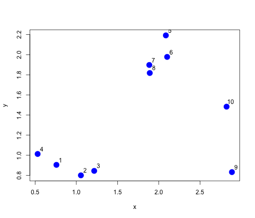
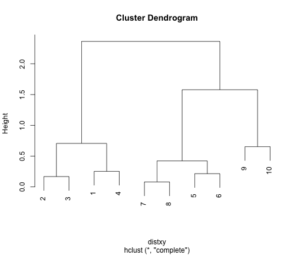
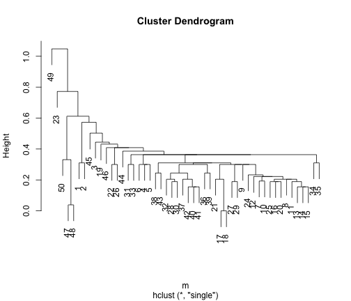

Laboratório sobre algoritmos de clustering - parte 2
========================================================
**Professor Fabrício J. Barth**

Introdução
----------
O objetivo deste laboratório é exercitar os conceitos vistos em sala de aula sobre algoritmos de agrupamento hierárquicos utilizando a **ferramenta R**.


```r
set.seed(1234)
x <- rnorm(10, mean = rep(1:3, each = 4), sd = 0.2)
y <- rnorm(10, mean = rep(c(1, 2, 1), each = 4), sd = 0.2)
plot(x, y, col = "blue", pch = 19, cex = 2)
text(x + 0.05, y + 0.05, labels = as.character(1:10))
```

 


```r
dataFrame <- data.frame(x = x, y = y)
dist(dataFrame)
```

```
##          1       2       3       4       5       6       7       8       9
## 2  0.31467                                                                
## 3  0.46219 0.16741                                                        
## 4  0.25218 0.56605 0.70633                                                
## 5  1.84900 1.73150 1.60308 1.95140                                        
## 6  1.71895 1.57491 1.43741 1.84318 0.21451                                
## 7  1.50181 1.37573 1.24714 1.61768 0.35610 0.23054                        
## 8  1.45449 1.31633 1.18353 1.58016 0.42198 0.26455 0.08023                
## 9  2.12974 1.83191 1.67027 2.36314 1.57792 1.38907 1.46248 1.40125        
## 10 2.14299 1.89389 1.72741 2.33890 1.02188 0.87426 1.02459 0.98960 0.65385
```


```r
dataFrame <- data.frame(x = x, y = y)
distxy <- dist(dataFrame)
hClustering <- hclust(distxy)
plot(hClustering)
```

 


Vamos utilizar um dataset sobre carros com medidas de velocidade e distância de parada. Este dataset foi gerado em 1920. As velocidades foram medidas em _mph_ e a distância em _ft_


```r
data(cars)
head(cars)
```

```
##   speed dist
## 1     4    2
## 2     4   10
## 3     7    4
## 4     7   22
## 5     8   16
## 6     9   10
```

```r
summary(cars$speed)
```

```
##    Min. 1st Qu.  Median    Mean 3rd Qu.    Max. 
##     4.0    12.0    15.0    15.4    19.0    25.0
```

```r
summary(cars$dist)
```

```
##    Min. 1st Qu.  Median    Mean 3rd Qu.    Max. 
##       2      26      36      43      56     120
```

```r

cars$speed_scale <- scale(cars$speed)
cars$dist_scale <- scale(cars$dist)

m <- dist(cars[, 3:4])
```


Agrupamento hierárquico formado a partir de **ligação completa**.


```r
plot(hclust(m, method = "complete"))
```

 


Agrupamento hierárquico formado a partir de **ligação simples**.


```r
plot(hclust(m, method = "single"))
```

 


Agrupamento hierárquico formado a partir da **média do grupo**


```r
plot(hclust(m, method = "average"))
```

 


Agrupamento plano com dois _clusters_


```r
clusterModel <- kmeans(cars[, 3:4], centers = 2)
plot(cars[, 3], cars[, 4], col = clusterModel$cluster, pch = 19)
```

 

